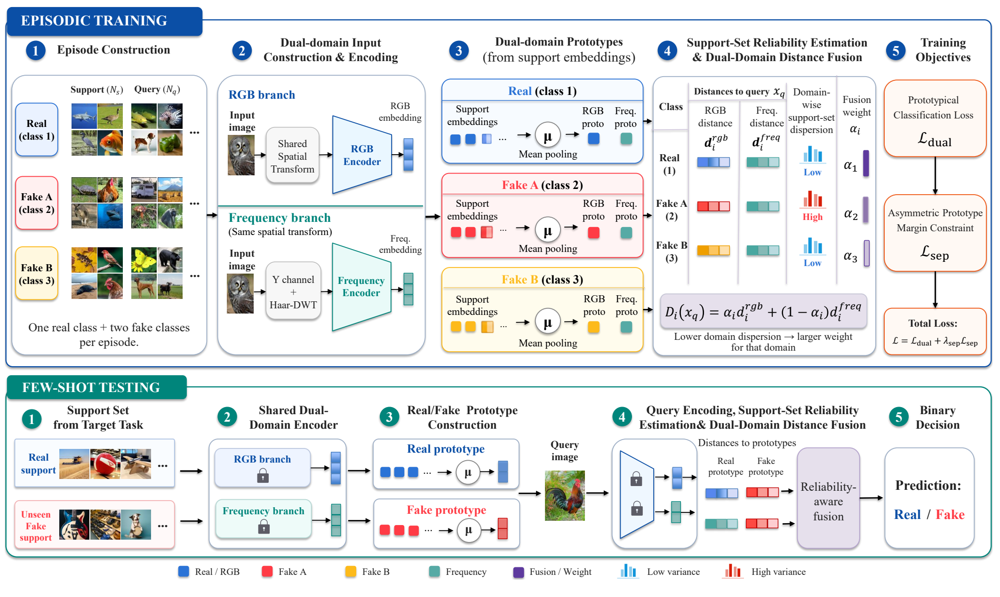

# DDFSD: Dual-Domain Prototypical Learning for Few-Shot AI-Generated Image Detection

<p align="center">
  <a href="https://github.com/zenghao0718/Dual-Domain-Few-Shot-AIGI-Detector/stargazers"></a>
  
  = 2.3.0">
  <a href="./LICENSE"></a>
</p>

---

## Overview

This repository provides the implementation of DDFSD, a few-shot detector for identifying AI-generated images from an unseen target generator. DDFSD learns dual-domain prototype spaces from RGB content and signed high-frequency Haar-DWT responses. Class-specific adaptive weights fuse the two domains according to support-set dispersion, allowing the more reliable domain to contribute more strongly to each class decision.

During episodic training, an asymmetric prototype margin strengthens real-fake separation while preserving structure between fake-generator classes. At test time, the encoders remain frozen: real and fake prototypes are built directly from the target support set, and the remaining target images are classified without gradient updates on the target generator.

<p align="center">
  
</p>
<p align="center"><em>Fig. 1: Overall framework of DDFSD.</em></p>

---

## Repository Structure

```text
Dual-Domain-Few-Shot-AIGI-Detector/
|-- datasets/
|   `-- ddfsd_datasets.py          # GenImage loading, transforms, and data iterators
|-- figs/
|   `-- ddfsd_framework.png        # DDFSD framework figure
|-- model/
|   |-- ddfsd.py                   # RGB/frequency encoders and projection heads
|   `-- ddfsd_losses.py            # Prototype, fusion, and margin objectives
|-- scripts/
|   |-- train_main.sh              # Train one leave-one-generator-out task
|   |-- eval_main.sh               # Evaluate one trained task
|   `-- run_main_experiment.sh     # Run all leave-one-out tasks
|-- tests/
|   `-- test_ddfsd_core.py         # Core unit tests
|-- util/                          # Evaluation, frequency, sampling, and logging helpers
|-- train_ddfsd.py                 # Training entry point
|-- test_ddfsd.py                  # Formal evaluation entry point
|-- requirements.txt
|-- LICENSE
`-- README.md
```

---

## Dataset

The main protocol uses **GenImage** with the following seven project-level categories:

- `real`
- `ADM`
- `BigGAN`
- `glide`
- `Midjourney`
- `SD`
- `VQDM`

`SD` is the merged Stable Diffusion category used by this project. `DATA_ROOT` must point directly to the `GenImage` directory that contains all seven category directories:

```text
GenImage/
|-- real/
|   |-- train/
|   `-- val/
|-- ADM/
|   |-- train/
|   `-- val/
|-- BigGAN/
|   |-- train/
|   `-- val/
|-- glide/
|   |-- train/
|   `-- val/
|-- Midjourney/
|   |-- train/
|   `-- val/
|-- SD/
|   |-- train/
|   `-- val/
`-- VQDM/
    |-- train/
    `-- val/
```

GenImage is not included in this repository. The repository also does not currently provide a complete utility for automatically converting the original GenImage release into this seven-category layout; users must prepare the data accordingly.

---

## Baseline Method

DDFSD builds on the episodic prototypical-learning paradigm introduced by **FSD: Few-Shot Learner Generalizes Across AI-Generated Image Detection** and extends it with dual-domain prototype learning, support-dependent distance fusion, and an asymmetric prototype-margin objective.

---

## Environment

| Item | Recommended setting |
| --- | --- |
| Python | Python 3.10 |
| PyTorch | `torch>=2.3.0`, as specified in `requirements.txt` |
| GPU | CUDA-capable GPU with a compatible PyTorch build |
| Execution | Single GPU; the training wrapper uses `torchrun --nproc_per_node 1` |

Core dependencies are:

```text
torch>=2.3.0
torchvision
timm
numpy
Pillow
scikit-learn
tensorboard
```

The shell wrappers require Bash. No specific GPU model or fixed VRAM capacity is required by the repository.

---

## Installation

```bash
git clone https://github.com/zenghao0718/Dual-Domain-Few-Shot-AIGI-Detector.git
cd Dual-Domain-Few-Shot-AIGI-Detector

python -m venv .venv
```

Activate the environment on Windows PowerShell:

```powershell
.venv\Scripts\activate
```

Or on Linux/macOS:

```bash
source .venv/bin/activate
```

Then install the dependencies:

```bash
python -m pip install --upgrade pip
pip install -r requirements.txt
```

If the default PyTorch package does not match your CUDA runtime, install the appropriate CUDA-enabled PyTorch build for your system before installing the remaining requirements.

---

## Checkpoints

Pretrained checkpoints can be downloaded from:

- [Baidu Netdisk](https://pan.baidu.com/s/1fXonbCSiWqMYksSyCAoN0A?pwd=vwq6)

Checkpoints are organized by the target class in the leave-one-generator-out protocol. Formal evaluation also requires the `freq_stats.pt` file produced by the matching training task. Follow the actual layout in the downloaded package when setting `CKPT_PATH` and `FREQ_STATS_PATH`.

---

## Data Preparation

Set the dataset root before running an experiment:

```bash
DATA_ROOT=/path/to/GenImage
```

`DATA_ROOT` must be the directory that directly contains `real`, `ADM`, `BigGAN`, `glide`, `Midjourney`, `SD`, and `VQDM`.

For a training task, the training script computes the frequency-domain mean and standard deviation from the training split of `real` and the five non-excluded fake classes, then saves them as `freq_stats.pt`. Formal evaluation must load the statistics produced by the corresponding training task; it must not estimate them again from validation or test images.

---

## Running DDFSD

### 1. Train One Leave-One-Generator-Out Task

```bash
DATA_ROOT=/path/to/GenImage \
EXCLUDE_CLASS=ADM \
bash scripts/train_main.sh
```

`EXCLUDE_CLASS` supports `ADM`, `BigGAN`, `glide`, `Midjourney`, `SD`, and `VQDM`. Training refuses to reuse an output directory that already contains checkpoints.

### 2. Evaluate One Task

```bash
DATA_ROOT=/path/to/GenImage \
EXCLUDE_CLASS=ADM \
bash scripts/eval_main.sh
```

By default, evaluation loads the step-15000 checkpoint and its matching `freq_stats.pt`. It performs 10-shot evaluation with seeds `42, 101, 102, 103, 104`, uses the complete remaining validation set as queries, and reports ACC, AP, and AUC. The published main protocol uses both branches with support-dependent adaptive fusion.

Set `RUN_ROOT`, `RUN_DIR`, `CKPT_PATH`, `FREQ_STATS_PATH`, or `OUTPUT_DIR` explicitly when the files are stored outside the default run layout.

### 3. Run All Six Leave-One-Out Tasks

```bash
MODE=all \
DATA_ROOT=/path/to/GenImage \
bash scripts/run_main_experiment.sh
```

The driver supports:

- `MODE=train` for training only
- `MODE=eval` for evaluation only
- `MODE=all` for training followed by evaluation

The six tasks run in the order `ADM`, `BigGAN`, `glide`, `Midjourney`, `SD`, and `VQDM`. The driver stops if any task fails.

---

## Main Configuration

| Item | Main setting |
| --- | --- |
| Data | Full GenImage |
| Protocol | Six-class leave-one-generator-out |
| Training | 15,000 steps; batch size 16; single GPU |
| Episode | 3-way: real + 2 fake classes |
| Episode samples | 5 support + 5 query images per class during training |
| RGB encoder | ResNet-50 |
| Frequency encoder | ResNet-18 |
| Embedding dimension | 512 |
| Frequency input | Signed Haar-DWT `LH`, `HL`, and `HH` bands from the Y channel |
| Scheduler | StepLR; step size 5,000; gamma 0.5 |
| Learning rates | Backbone `3e-5`; projection head `1e-4` for both domains |
| Prototype margins | `m_rf=1.2`; `m_ff=0.6`; `lambda_ff=0.5` |
| Separation weight | Target `lambda_sep=0.03`; linear warmup from step 2,500 to 7,500 |
| Branch dropout | Dual/RGB-only/frequency-only: `0.90 / 0.05 / 0.05` |
| Formal evaluation | Step 15,000; 10-shot; 5 seeds; full validation query set |
| Metrics | ACC / AP / AUC |

This table describes the runtime configuration, not experimental results.

---

## Output Structure

With the default experiment name, outputs are written outside the repository in the following layout:

```text
<run_root>/
`-- main_full_steps15000/
    `-- exclude_<class>/
        |-- ckpt/
        |   `-- ddfsd_step[15000].pth
        |-- tb/
        |-- logs/
        |   |-- train_driver.log
        |   |-- eval_driver.log
        |   `-- <timestamp>_log.txt
        |-- train.log
        |-- freq_stats.pt
        `-- formal_eval_step15000/
            |-- ddfsd_eval_per_seed.csv
            |-- ddfsd_eval_summary.csv
            |-- formal_val_invalid_images.csv
            |-- config.json
            |-- logs/
            |   `-- <timestamp>_log.txt
            `-- eval.log
```

The driver logs are created by `run_main_experiment.sh`; timestamped logger files are created by the Python entry points.

---

## Evaluation

Formal evaluation writes per-seed metrics to `ddfsd_eval_per_seed.csv`, aggregate mean and standard-deviation metrics to `ddfsd_eval_summary.csv`, the resolved protocol and paths to `config.json`, and console output to `eval.log`. It also audits the exact validation images before inference and records the audit in `formal_val_invalid_images.csv`.

TensorBoard events are stored under each task's `tb/` directory. Launch TensorBoard with a generic run root:

```bash
tensorboard --logdir /path/to/run_root/main_full_steps15000 --host 0.0.0.0 --port 6006
```

---

## Acknowledgements

We thank the authors of FSD (Few-Shot Learner Generalizes Across AI-Generated Image Detection) for releasing their work and code, which provided the foundation for this project.
